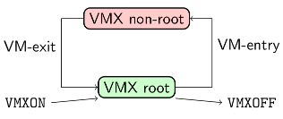

Internals
=========

Design
------

Cappsule is a small hypervisor (roughly 15K lines of `source code
<https://github.com/cappsule/cappsule-hypervisor>`_) designed for Linux
x86-64. It has been heavily tested on Ubuntu 16.04, but any distro with a recent
kernel should be able to use it. Since it relies on hardware virtualization, the
CPU must support Intel VT-x and EPT. In order to operate, Cappsule inserts 2
kernel modules (``cappsule.ko`` and ``cappsule_guest.ko``). A userland `daemon
<https://github.com/cappsule/cappsule-userland>`_ is responsible for the
communication between the userland and the kernel module.

For the record, Intel VT-x and EPT are described in the Intel® 64 and IA-32
Architectures Software Developer’s Manual, Volumes 3C: `System Programming Guide
Part 3
<http://www.intel.com/content/www/us/en/architecture-and-technology/64-ia-32-architectures-software-developer-vol-3c-part-3-manual.html>`_.
`OpenSecurityTrainings.info
<http://opensecuritytraining.info/AdvancedX86-VTX.html>`_ provides an excellent
introduction to Intel VT-x and the development of hypervisors.

For the sake of clarity and to avoid any confusion, a quick explanation about
the terminology is required. Cappsule, with an upper-case *C* is the project
name whereas cappsule(s) with a lower-case *c* is the VM's name.

Hypervisor
----------

Host Virtualization
~~~~~~~~~~~~~~~~~~~

The running system is `bluepilled
<https://theinvisiblethings.blogspot.fr/2006/06/introducing-blue-pill.html>`_:
the hypervisor is launched from the kernel module and a new VM called «`trusted
guest`» containing the running system is created. There are only two types of
VM: *trusted guest* and *cappsules*.

The only instance without restrictions is the bluepilled OS (trusted guest).
It's created during the launch of the hypervisor and stopped when the hypervisor
is removed. This doesn't affect the correct operation of the running system.
However, the hypervisor can still take control of the system when a VM exit
occurs. A few x86 instructions unconditionally trigger VM exits (for instance:
``cpuid``, ``vmcall``, etc.). Privileged operations such as VM creation are
initiated through ``ioctl`` from userland and through ``vmcall`` from
kernelland. On the one hand ``ioctls`` are handled by the trusted guest kernel
module and ``vmcalls`` by the hypervisor, on the other.

Cappsules (0 to n instances) are the lightweight VMs described below. They
aren't trusted by the hypervisor: they aren't allowed to access to hardware and
their memory is a copy-on-write version of the snapshot. The hypervisor kills
the cappsule when a forbidden operation (for instance, I/O instructions) occurs.

Memory Snapshot
~~~~~~~~~~~~~~~

Once the running system is bluepilled, the userland daemon does an ``ioctl`` to
initiate the memory snapshot, this is quite similar to the *suspend-to-RAM*
feature of the Linux kernel. The average snapshot size is typically under the
few hundred Mb. The kernel module of the trusted guest does a ``vmcall`` which
triggers a VM exit and the hypervisor finally does the snapshot (interrupts are
disabled in VMX root mode, this avoids race conditions). A copy of the whole
system memory is made except for:

- Userland pages, because userland processes are frozen before the snapshot and
  won't be able to resume their execution in cappsules
- Filesystem caches
- The code of the hypervisor, because an attacker may take advantage of it if a
  vulnerability were to be found
- Sensitive pages containing cryptographic keys should be zeroed, but we didn't
  implement this feature yet

However, there are a few subtleties related to locking. For instance, if a
kernel thread locks a mutex before the snapshot phase and the thread isn't
allowed to resume its execution, we just introduced a deadlock in the
cappsule's kernel. We try hard to avoid this situation by taking these locks
before the snapshot and unlocking them after.

Cappsule Creation
~~~~~~~~~~~~~~~~~

Once the snapshot is done, cappsules can finally be created. They are launched
by users through a small executable (``virt``) which communicates with the
userland daemon thanks to a JSON API. For example, the following request is sent
to the daemon when ``virt exec --policy unrestricted --no-gui bash`` is
executed:

.. code-block:: javascript

  {
    "cmd": "create",
      "params": {
        "cwd": "/home/user",
        "tty": "48x210",
        "env": [
          "GTK2_MODULES=overlay-scrollbar",
          "XMODIFIERS=@im=ibus",
          "...",
        ],
        "basedir": "/home/user/.cappsule/unrestricted",
        "no-gui": true,
        "argv": [
          "bash"
        ],
        "fstype": "overlay",
        "groups": "4,24,27,30,46,114,115,1000",
        "memory": 1024,
        "policy": "unrestricted",
        "miscfs": [],
        "display": "",
        "rootfs": "/"
      }
  }

The daemon converts this request to an ``ioctl``, which tells the hypervisor to
create a new VM. The daemon also launches the device servers (``netserver``,
``fsserver``, but no ``guiserver`` because of the ``--no-gui`` option)
associated to these cappsule. A new kernel thread (called *shadow process*)
associated to this VM is created:

.. code-block:: shell

    $ ps fauxw | grep capsule
    root       8856  2.3  0.0      0     0 ?        S    16:23   0:00  \_[capsule-5]

CPU Virtualization
~~~~~~~~~~~~~~~~~~

Hardware virtualization allows fine grain control for the execution of
privileged instruction by a guest. VM behavior is configured through a *VM
Control Structure* called ``VMCS``. In order to avoid any modification of the
host, it's crucial to restrict the CPU registers and MSRs to which guests can
write to.  Each VM is associated with a different ``VMCS`` and are configured to
trigger a VM exit when some instructions are executed by the guest. Cappsule
implements a set of two VMCS templates, which allows the allocation and creation
of different VMCS correctly configured for the trusted guest and the cappsules.

Even if virtualization is activated on every CPU, only one of them is available
from a given cappsule. The reason is simple: every other CPU (but the current
one) is offlined before snapshoting and put right back online after the snapshot
is completed. This method allows several cappsules to run simultaneously on
different CPUs. Having one CPU in a cappsule is way easier to handle and avoid a
lot of race condition attacks.

.. code-block:: shell

    user@ubuntu:~$ cat /sys/devices/system/cpu/online
    0-3
    user@ubuntu:~$ virt exec -p unrestricted -n bash
    user@capsule-6:~$ cat /sys/devices/system/cpu/online
    0

Memory Virtualization
~~~~~~~~~~~~~~~~~~~~~

Memory is virtualized with Intel EPT, which introduces a new set of page tables
to convert guest physical addresses (GPA) to host physical addresses (HPA).This
set of page tables is initialized with freshly allocated pages to share memory
between the cappsule and the host.

Once the cappsule starts its execution, the algorithm to handle EPT violations
is trivial: if the requested GPA is present in the snapshot, this page is given
to the guest (copy-on-write), otherwise a new page is allocated. This algorithm
guarantees that VMs can only access to a copy-on-write version of the kernel
memory as seen during the snapshot. As a side effect, no DMA is possible. Since
I/O instructions aren't allowed, there's no feasible hardware access.

VM Scheduling
~~~~~~~~~~~~~

A CPU is exclusively in one of these 2 modes: VMX root or VMX non-root. The
hypervisor is executed in VMX root while the trusted guest and the cappsules are
executed in VMX non-root.

A kernel thread (the shadow process) executed in the kernel of the trusted guest
is associated to each VM and is responsible of its scheduling. The algorithm
executed by kernel threads is straightforward:

.. code-block:: c

  VMLAUNCH;
  while (!stop) {
    VMRESUME;
    schedule();
  }

The hypervisor stops the current cappsule when a VM exit occurs or when its time
quantum is reached. VMs can also inform the hypervisor, thanks to a ``vmcall``
that they want to pause their execution when the idle thread is executed. Shadow
processes, while being kernel threads, are allowed to receive 2 signals:
``SIGKILL`` and ``SIGTERM``. If one of these signals is received, or the
``init`` process inside the cappsule terminates, the shadow processes exits and
the associated cappsule is killed . The cappsule may also be killed during a VM
exit if it does a forbidden operation (e.g. execution of an I/O instruction).

Cappsule's Kernel
-----------------

A cappsule begins its execution in a kernel stub (in ``cappsule_guest.ko``)
which proceeds to various initializations (timer, date, shared memory, tty,
etc.). The snapshot memory is slightly modified in order to hijack saved RIP in
the kernel stack, and return in the ``ioctl`` code which triggered the snapshot
creation. During the memory snapshot, almost no processes currently running will
be allowed to continue their execution in the cappsules. For example, the
scheduling of I/O threads isn't allowed. There are a few exceptions for
necessary kernel threads and workqueues: ``watchdog``, ``vmstat``,
``vmstat_update``, etc. Four userland processes are also allowed: the snapshot
process (``init``), ``fsclient``, ``guiclient`` and ``netclient``.

A few hooks are necessary and the hypervisor is responsible for handling the
VM-exits when breakpoints are hit. For example, ``vt_console_print()`` is hooked
to export cappsule's dmesg to the host. Some APIC related functions are also
patched to avoid hardware access which would cause the cappsule to be killed.

Devices
-------

Since cappsules aren't allowed to access hardware, devices are mostly
pointless. 4 userland devices emulate the following features: filesystem, net,
console and GUI. These devices are divided in 2 parts: a host process and a
guest process, communicating through shared memory (this mechanism is called
*xchan* in Cappsule's source code). For instance, the net device is composed of
a userland process called ``netclient`` running in the cappsule and
``netserver``, a userland process running in the host and working as a filtering
proxy.

Filesystem
~~~~~~~~~~

The Linux kernel doesn't make any direct access to the filesystem except for
crashdumps. Thanks to this assumption, the init process of the cappsule chroots
into a FUSE filesystem. ``fsclient`` (the FUSE process running in the cappsule)
communicates with ``fsserver`` (running in the host) through shared
memory. ``fsserver`` applies rules to allow or forbid access to files and
folders.

If allowed, this mechanism allows cappsules to access the host filesystem
transparently. An interesting consequence is that software updates in the host
are instantly available in running cappsules. Additionally, overlayfs is used to
provide a copy-on-write filesystem; thus, the host filesystem is never modified.

Finally, ``fsserver`` is executed with the privileges of the user who launched
the cappsule. Even if an issue were to be found in the rules, the whole host
filesystem wouldn't be compromised.

Net
~~~

The userland process ``netclient`` (inside the cappsule) creates a TUN
interface. It communicates with the ``netserver`` host process through shared
memory. ``netserver`` also creates a TUN interface and a set of iptables rules
to filter packets coming from the cappsule according to cappsule's policy.

GUI
~~~

The GUI is the only component not developed from scratch. It's a fork of the
graphical part of Qubes OS, which fits perfectly into our model.

In the cappsule, an X11 server instance is launched alongside a specific
window manager (``guiclient``), forwarding each GUI operation to the host
through shared memory. Since the protocol between guiclient and guiserver is
custom, ``guiserver`` translates and forwards the requests to the host X11
server. Detailed information about the Qubes GUI protocol can be found `here
<https://www.qubes-os.org/doc/gui/>`_.
